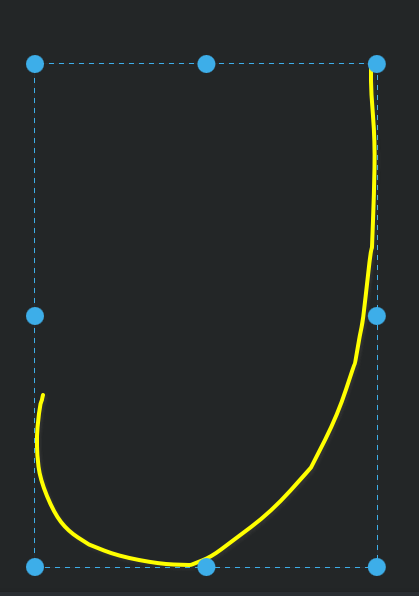
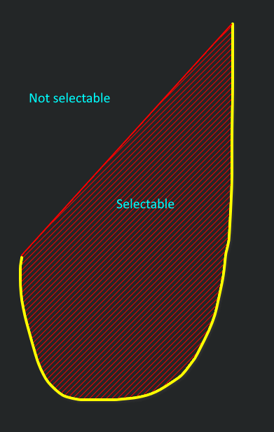
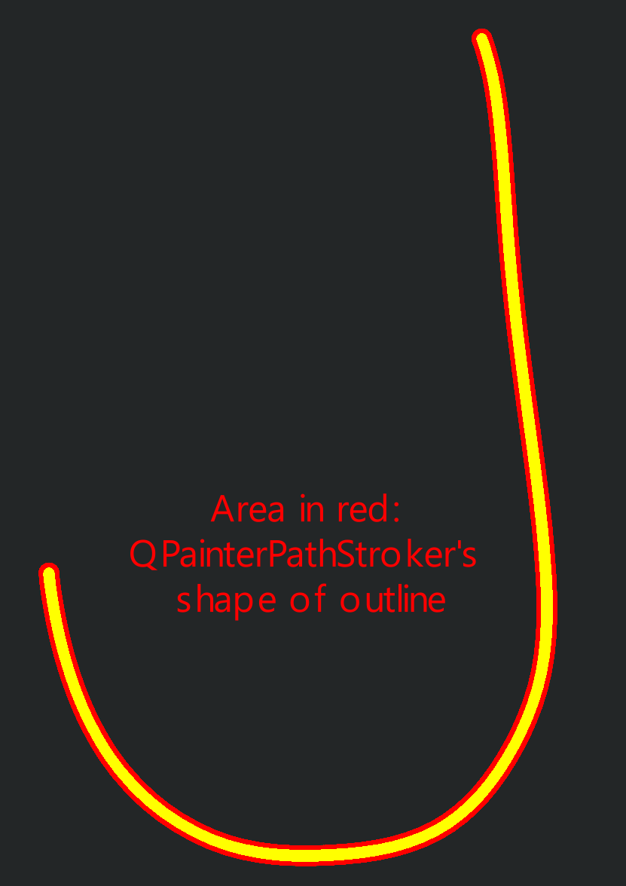
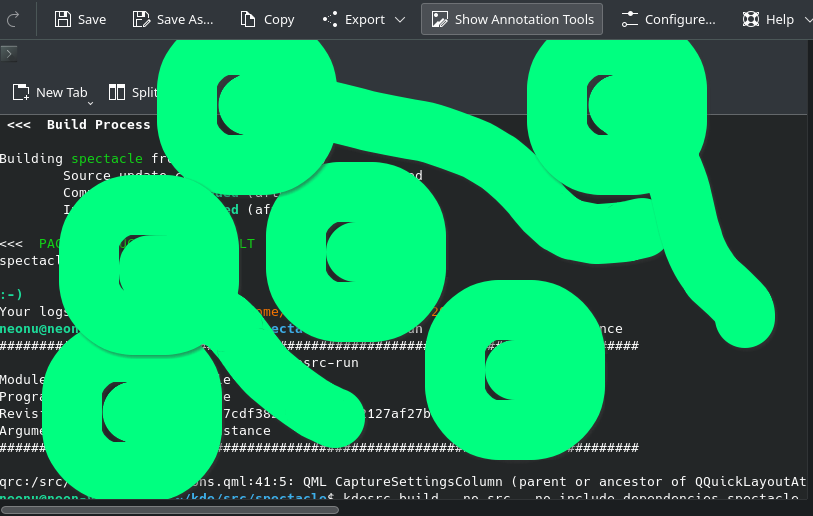
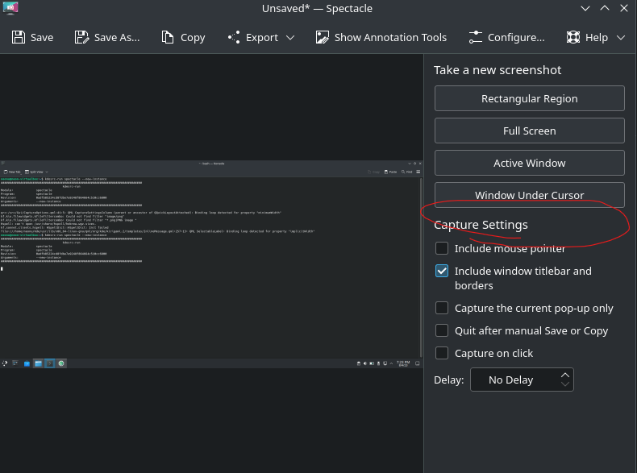
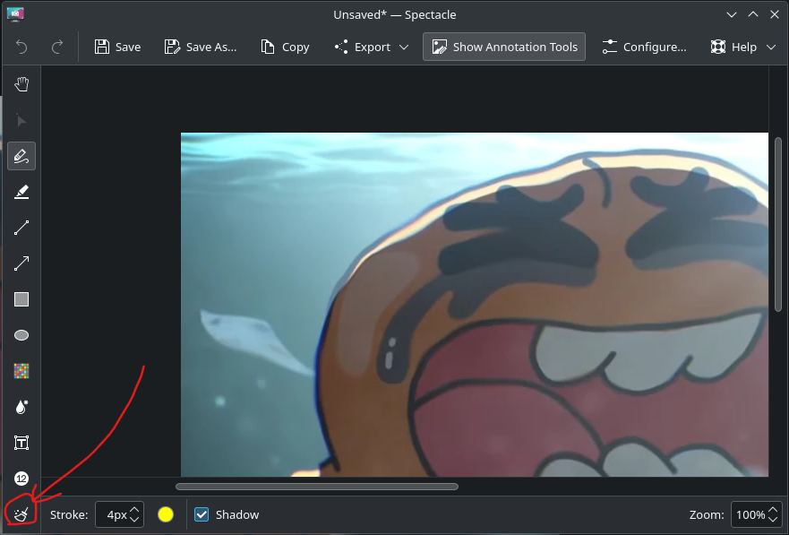
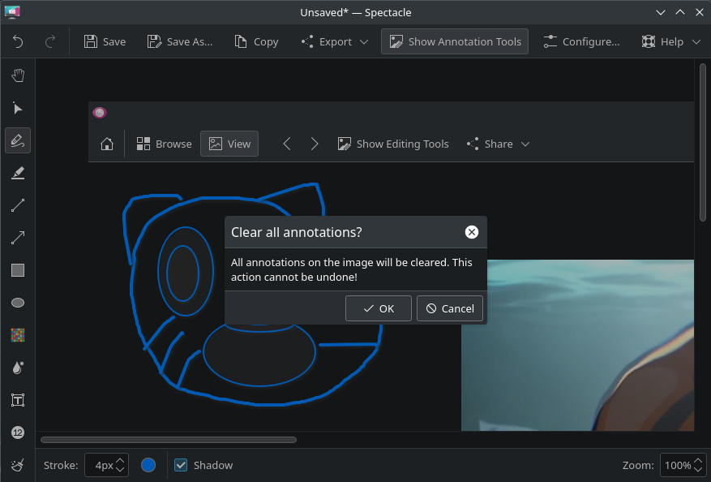
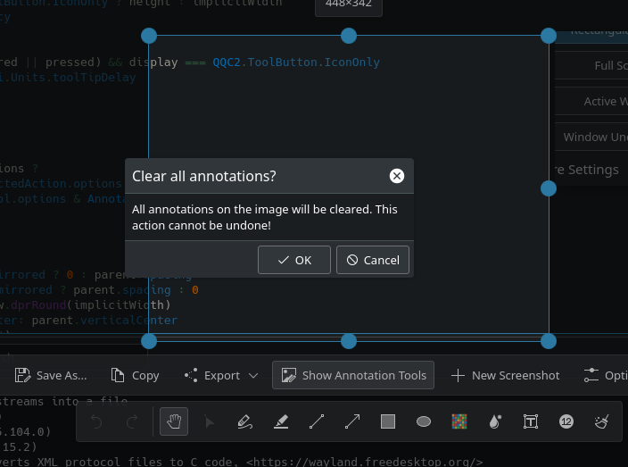

# Brennanzuz's Season of KDE 2023 blog

## Background
I first learned about free and open-source software (FOSS) when using [Audacity](https://www.audacityteam.org/) for audio editing back in 2016. Until someone told me about it, I have never realised so much of my daily tasks on the computer is thanks to open-source software. A year later, after being frustrated with Painter Essentials 5, I got to know and installed [Krita](https://krita.org/en/). The software was immaculate, it was packed with features; assistants, stroke smoothing, brush customisation bewildered me with so many choices I've never had using a proprietary software. "Who in the world would put these out for free when Corel is selling theirs for hundreds!?", and then I found out about the FOSS community. To this day I have great admiration for these altruists making the world a better place through their expertise in software development. So this semester, I give [Season of KDE](https://season.kde.org/) (SoK) a try and see how these heroes work their magic.

## Joining SoK

With Bharadwaj Raju graciously accepting to be my mentor, I was given an opportunity to contribute to [Spectacle](https://invent.kde.org/graphics/spectacle), the screenshot application of KDE Plasma, the second most popular Linux desktop environment. I have previously dabbled into Linux to try to make the switch to it as my main operating system as a pledge towards FOSS, but alas, it posed to many problems for me to use practically in university where most software requires Windows. So, I returned to Linux, but already with a great impression of KDE's emphasis on user-friendliness compared to some other distributions, I was thus fairly optimistic to make this work. As a university student with background knowledge in C, looking at Qt and QML did not seem that bad to me. In fact, looking at the source code was pretty exciting; unpacking each function and seeing how, for example, undo and redo uses a stack which I learnt in my data structures course. With this determination to understand the inner workings of a drawing software I've so wanted to study, I planned for my first feature.

## Implementing an eraser tool

This feature was inspired by the eraser tool of Microsoft OneNote and [Xournal++](https://github.com/xournalpp/xournalpp/) which don't use a raster-based drawing of strokes, and thus erasing is by deleting stroke by stroke.

### User interface

First thing to do is to add an eraser button. Just below the freehand button would do, just like any other drawing software. Despite not knowing any QML, this was fairly straightforward by just reusing the code from the other `ToolButton` and changing the icon I found using Cuttlefish.
```
    ToolButton {
        QQC2.ButtonGroup.group: toolGroup
        text: i18n("Erase Annotations")
        icon.name: "draw-eraser"
        checked: AnnotationDocument.tool.type === AnnotationDocument.Erase
        onClicked: AnnotationDocument.tool.type = AnnotationDocument.Erase
    }
```

### Functionality

To delete these strokes, I first had to understand what they are. The main files I would need to look at are:
1. `AnnotationDocument.cpp`: Current tool, undo stack, types of actions to add for each case.
2. `EditAction.cpp`: The behaviour of each action.
3. `AnnotationViewport.cpp`: Mouse events.

I learnt that almost every annotation is a QPainterPath object. Now what's needed is how to delete them.

#### Idea: mimic the freehand tool

At first, my plan was to make the eraser behave like the freehand tool: has a width, and draws a path of destruction that deletes everything in its path. Alright, so it needs to draw a QPainterPath that is invisible (no colour), has a certain width, and everything that intersects its shape will be deleted at run time. Knowing this I tried to give the eraser its `strokeWidth` settings just like a `Stroke` object would. However, I soon ran into problems trying to make an eraser like a `Stroke` as the `Option` enum was starting to mess with its settings that made it really clunky. Stuck, I soon contemplated my next best option, and that was to basically mimic the select tool instead of the freehand tool.

#### Idea: mimic the select tool

What this means is that the eraser would send a continuous "kill zone" whereby each frame will "select" the annotation under the cursor and delete it immediately. Seems simple enough. Upon investigating how the select tool works, this neat method `actionAtPoint(point)` allows you to detect whatever annotation is at that point. After many hours of deciphering the code, this was just the convenient function I needed.

Now all that's needed is for this tool to act every frame. After more searching, I found out that a mouse click event in `AnnotationViewport.cpp` causes the `beginAction()` function in `AnnotationDocument.cpp` to run, which will then be filtered out to by the switch statement based on the current tool `m_tool` being used. So I just added a new case for `Eraser` that does this new `eraseAction(point)` function that does this:
```
void AnnotationDocument::eraseAction(const QPointF &point)
{
    auto *actionToDelete = actionAtPoint(point);
    if (!actionToDelete) {
    return;
    }
    deleteAction(actionToDelete);
}
```
Which is actually just code inspired by `deleteSelectedAction()`:
```
void AnnotationDocument::deleteSelectedAction()
{
    auto *action = m_selectedActionWrapper->editAction();
    if (!action || m_undoStack.contains(action->replacedBy())) {
        return;
    }

    deselectAction();
    deleteAction(action);
}
```
minus the deselectAction part. It actually works! But whoops, seems like we have 3 major problems:
1. After using the freehand tool and then switching to the eraser, the eraser extends the stroke to where it is as if it's still on the freehand tool.
2. The eraser cannot continuously delete if I slide the cursor across multiple annotations.
3. The eraser deletes a freehand stroke even though it is not even on it.

#### Problem 1: Not terminating a stroke

To understand why the freehand stroke does not terminate and for the eraser to take over even after switching to a tool such that the switch statement for the freehand should not even run in the first place, I looked towards the `mousePressEvent()`, `mouseMoveEvent()` and `mouseReleaseEvent()` in `AnnotationViewport.cpp`. Everything looks alright here - `beginAction()`, `continueAction()` and `endAction()` run respectively. I was most stumped by this problem - could it be that the action was not valid such that `mouseReleaseEvent()` did not run? 

I had many doubts, but none were close to suspecting that the switch statements were the problem - the tool is clearly selected! But within the switch statements there was one perculiar difference that `continueAction()` had that `beginAction()` did not.

`beginAction()`:
```
    switch (m_tool->type()) {
    case FreeHand:
    case Highlight: {
        action = new FreeHandAction(m_tool, point);
        addAction(action);
        break;
    }
```
`continueAction()`:
```
auto action = m_undoStack.isEmpty() ? nullptr : m_undoStack.last();
```
```
    switch (action->type()) {
    case FreeHand:
    case Highlight: {
        auto *fha = static_cast<FreeHandAction *>(action);
        fha->addPoint(point);
        emitRepaintNeededUnlessEmpty(fha->lastUpdateArea());
        break;
    }
```
`continueAction()` does not use `m_tool` but instead chose to take the top of `m_undoStack()` which gives the last made action instead. This means that regardless of what tool is currently selected, `continueAction()` would treat your current tool to be what was last done. This would have worked for all of what Spectacle's annotations could do, but not for deleting. This was because the eraser was not adding any actions when `mousePressEvent()` triggers when pressing on an empty spot, and thus the stroke was extended on the next move of the cursor.

My past self made this lucky guess, changed `action->type()` to `m_tool.type()` and everything was lovely again. Wonderful. 

#### Problem 2: No continuous deletion

Again, I had to investigate what `continueAction()` was doing and why was it that `eraseAction()` was not triggering. I first doubted the switch statement, again, but this time I had to instead believe that `continueAction()` terminated earlier than the switch statement can execute. 

Seems like this `action` variable really likes to mess with me:
```
    auto action = m_undoStack.isEmpty() ? nullptr : m_undoStack.last();
    if (!action || action->type() == None || m_tool->type() == ChangeAction) {
        return;
    }
```
The function terminates early here, but which statement could have evaluated true? Eraser is an action, `m_tool->type()` is not `ChangeAction`, and _the eraser deleting an annotation is not a considered a `None` action_ right? Right?

Well turns out that the deleteAction that is added to the stack is of `type() == None`. So I just removed this check and everything worked again:
```
    if (!action || m_tool->type() == ChangeAction) {
        return;
    }
```

#### Problem 3: Weird hurtboxes

To understand why these annotations were getting deleted 50 meters away from the cursor, I had to investigate that magic function `actionAtPoint()`:
```
EditAction *AnnotationDocument::actionAtPoint(const QPointF &point) const
{
    for (int i = m_undoStack.count() - 1; i >= 0; --i) {
        auto action = m_undoStack[i];
        if (isActionVisible(action) && action->visualGeometry().contains(point)) {
            return action;
        }
    }
    return nullptr;
}
```
Seems that each action has a `visualGeometry()` which is basically a bounding rectangle that stretches from the strokes minimum x and minimum y to maximum x and maximum y. While this makes selecting the stroke really easy, it also makes deleting them really imprecise and causes many bounding boxes to overlap when many annotations are in one place, which is common in handwriting.



So was there an easy way to get the shape of just the stroke? Well kinda... All of these freehand strokes have a property `m_path` which is a `QPainterPath`, and luckily for me, after looking through the docs a lot, they have this neat [`contains()`](https://doc.qt.io/qt-5/qpainterpath.html#contains) function that does just what I want. So I just filter out all the freehand strokes to be detected using their stroke shapes, while leaving the other annotations alone:
```
EditAction *AnnotationDocument::actionAtPoint(const QPointF &point) const
{
    for (int i = m_undoStack.count() - 1; i >= 0; --i) {
        auto action = m_undoStack[i];
        switch (action->type()) {
        case FreeHand: {
            auto *fha = static_cast<FreeHandAction *>(action);
            if (isActionVisible(action) && fha->path().contains(point)) {
                return action;
            }
            break;
        }
        default:
            if (isActionVisible(action) && action->visualGeometry().contains(point)) {
                return action;
            }
        }
    }
    return nullptr;
}
```

But now we have another problem. Turns out that these QPainterPaths are closed shapes, whereas strokes are open shapes. This means that, invisibly, the `m_path` looks like this:



and so, while an improvement, is still imprecise. I was kinda at a dead end, but luckily for me, there were people who faced similar issues before when trying to solve a problem. The looked through these:
1. [intersection of the free form draw painterpath](https://stackoverflow.com/questions/28690523/intersection-of-the-free-form-draw-painterpath)
2. [Shortest distance between a QPainterPath and a QPoint](https://stackoverflow.com/questions/35584121/shortest-distance-between-a-qpainterpath-and-a-qpoint)
3. [find the lines cross while draw free path using QPainterPath](https://stackoverflow.com/questions/28603623/find-the-lines-cross-while-draw-free-path-using-qpainterpath)

And looking through these made me reconsider making the eraser mimic the freehand drawing tools, because at least those would create another `QPathPainter` object for easier comparison. But thankfully an answer was found [here](https://stackoverflow.com/questions/53950031/get-clicked-point-along-qpainterpath), whereby a [`QPainterPathStroker`](https://doc.qt.io/qt-5/qpainterpathstroker.html#createStroke) could instead be created within the QPainterPath. What this would look like is something I envisioned in Krita's (have I told you how much I love Krita?) border selection option, which selects the outline of an existing selection like this:



And since the stroke's outline is a closed shape, it is a QPainterPath that can now use the same `contains()` method as above. Nice. So I created a new `contains()` method for `FreeHandAction` that does just this:
```
// Checks if point lies within the stroke and not just within its closed shape.
bool FreeHandAction::contains(const QPointF &point)
{
    QPainterPathStroker stroker;
    // Set the stroker path to be slightly bigger for easier selecting and deleting.
    stroker.setWidth(strokeWidth());
    QPainterPath strokePath = stroker.createStroke(path());
    return strokePath.contains(point);
}
```
and after changing the above check for filtering out free hand actions from `fha->path().contains(point)` to `fha->contains(point)`, all strokes were now accurately deleted. Consequently, this also changed the way strokes are selected using the select tool. However, there's still an annoying problem.

#### Problem 4: Cannot erase single point strokes

I define "single point strokes" to be when the freehand tool is pressed, and then released without moving, thus creating a single dot as an annotation. There was a problem whereby the eraser cannot detect the shape of this dot, and thus cannot be deleted. This was most likely because `continueAction()` did not execute due to the mouse never moving in this period and thus only `beginAction()` and `endAction()` executed. I thus tried to replicate what `continueAction()` does in `beginAction()` in hopes that a point can be added during `beginAction()` to make the dot have a shape, but there was no effect observed. This might be because, inherently, the shape of the stroke is simply a point; 0 pixels wide. 

I thus decided to make a shape instead. Conveniently, there is a check for if the mouse is right above where the stroke was last, and if so, will `return` and do nothing. So instead, let's add an inexplicably small point to give it a tangible shape:
```
void FreeHandAction::addPoint(const QPointF &point)
{
    if (m_path.currentPosition() == point) {
        // To allow contains() to detect a single point drawn.
        m_path.addEllipse(point, 0.1, 0.1);
    }
    m_path.lineTo(point);
    m_lastUpdateArea = getUpdateArea();
}
```
It certainly solved the problem, and I only settled with `0.1` after some testing. `1` was too big and gave each stroke a little dot to begin with, and setting the width to be variable to the stroke width is not a good idea either, as even more massive circles will be drawn:



A part of me still doesn't sit right with this fix though, as not only was a literal used (`0.1`) that may be considered bad practice, but it felt like a plastered-on behind-the-scenes kind of fix that you hope the user doesn't see.

Nonetheless, the eraser works as it should and has given me a much easier time removing annotations.

[Link to merge request](https://invent.kde.org/graphics/spectacle/-/merge_requests/221)

## Implementing clear annotations

The next feature was going to be much easier. Currently, there is no way to quickly delete all annotations on the screenshot in the event that the user wants to clear the "whiteboard" so to speak, short of selecting and deleting each annotation, or using that sweet new eraser tool. In my time diving into the code, I found this `clear()` function in `AnnotationDocument()` which seemed pretty nifty and is only used when a new screenshot was taken. So this shouldn't be too hard.

### User interface

I had a hard time picking out a place to put this new button in a way that the user will not accidentally press it and delete all their progress, and will also not be obstructive. I wanted it here for example:



But it did seem to be obstructing the more important options for making a new screenshot, so I decided to place it with the other annotation tools for now:



```
    ToolButton {
        QQC2.ButtonGroup.group: toolGroup
        text: i18n("Clear All Annotations")
        icon.name: "edit-clear-all"
        onClicked: clearAnnotationsPromptDialog.open()
    }
```
which uses a nice brush icon I found on Cuttlefish again.

The next thing to do was to create a message box for the user to irreversibly confirm clearing the annotations. The hardest struggle here was trying to figure out QML to make a [`Kirigami.PromptDialog`](https://api.kde.org/frameworks/kirigami/html/classorg_1_1kde_1_1kirigami_1_1PromptDialog.html) appear. I have never touched a markup language like HTML, so here I am scratching my head at how to call a function in the C++ file (you don't). After getting a lot of help from my mentor Bharadwaj Raju, I learnt that you're supposed to declare the `PromptDialog` as a child of the UI and set an id to which it can be called by the parent's children objects. At first the message box was declared here in `AnnotationOptionsToolBarContents.qml` which squished the message box to this slither of space. So instead, it should be declared in the annotation space instead in `ImageView.qml`.

```
    Kirigami.PromptDialog {
        id: clearAnnotationsPromptDialog
        title: "Clear all annotations?"
        subtitle: "All annotations on the image will be cleared. This action cannot be undone!"
        standardButtons: Kirigami.Dialog.Ok | Kirigami.Dialog.Cancel

        onAccepted: AnnotationDocument.clearAnnotations()
    }
```

I also found out later that there were actually two modes in which an annotation can be made: after taking a screenshot, and during the rectangular region screenshot preview, which is defined in `ImageCaptureOverlay.qml`

and thus a nice message box appears right in the middle:





### Functionality

Whelp I already know I need to do, and that is to ~~steal~~ borrow all that code from `clear()`:

```
void AnnotationDocument::clear()
{
    qDeleteAll(m_undoStack);
    m_undoStack.clear();
    m_undoStack.squeeze();
    qDeleteAll(m_redoStack);
    m_redoStack.clear();
    m_redoStack.squeeze();
    clearImages();
    m_tool->resetType();
    m_tool->resetNumber();
    Q_EMIT undoStackDepthChanged();
    Q_EMIT redoStackDepthChanged();
    Q_EMIT repaintNeeded();
}
```

minus the `clearImages()` part.
```
void AnnotationDocument::clearAnnotations()
{
    qDeleteAll(m_undoStack);
    m_undoStack.clear();
    m_undoStack.squeeze();
    qDeleteAll(m_redoStack);
    m_redoStack.clear();
    m_redoStack.squeeze();
    m_tool->resetType();
    m_tool->resetNumber();
    Q_EMIT undoStackDepthChanged();
    Q_EMIT redoStackDepthChanged();
    Q_EMIT repaintNeeded();
}
```
as simple as that.

[Link to merge request](https://invent.kde.org/graphics/spectacle/-/merge_requests/223)

## Conclusion

I set off on this project during my school semester, and though I had hoped to do much more, I have learnt a lot about software development. This is especially because this project came at the right time as I am taking my software engineering and object-oriented programming course during SoK's period. I was thus able to apply whatever I learnt about Github to Gitlab, Git to the CLI Git commands, and basic professionalism when working in a team. They both thus complemented each other perfectly. 

I have managed to make a tangible change to a software I use often and see myself using these new features aptly. Once everything is settled, perhaps my changes will be permanent and seen in a future version of Spectacle. I imagine the great number of people using it, and I can humbly say that I had a tiny fraction of contribution in making this possible. 

FOSS is an underrated form of philanthropy, and I am grateful for all FOSS developers who dedicated so much more time than I did during SoK to bring us absurd quality software for all to enjoy and use on a daily basis without any strings attached. They have provided research material for all to study and has made the world a more educated place.

I would like to thank:
* [nmariusp](https://www.youtube.com/@nmariusp) for his activity on Matrix and always contributing [videos](https://www.youtube.com/watch?v=U_4ohrtZIXA) and [documentation](https://community.kde.org/Get_Involved/development/IDE_configuration/KDevelop) to help newcomers, and for getting on a call with me to understand FOSS better.
* [Noah Davis](https://invent.kde.org/ndavis) for reviewing my merge requests with positive reinforcement, clear direction and communication.
* [Nate Graham](https://invent.kde.org/ngraham) for testing my code and being an active contributor as always.
* [Andy Betts](https://invent.kde.org/abetts) for providing feedback on the merge request.

I would especially like to thank [Bharadwaj Raju](https://invent.kde.org/bharadwaj-raju) for accepting me as my mentee in the first place. He has always answered to my questions, and has made it clear since day 1 that he was very approachable and open to any of them. He was open to accepting requests for voice calls with me over Matrix to administer clearer communication, even if he had not done something like that before. He has guided me to where I must look next and his extensive knowledge over the software allowed him to be an excellent mentor for orientating new contributors through the source code. 

I am grateful for this opportunity and hope to contribute back to FOSS in the future.